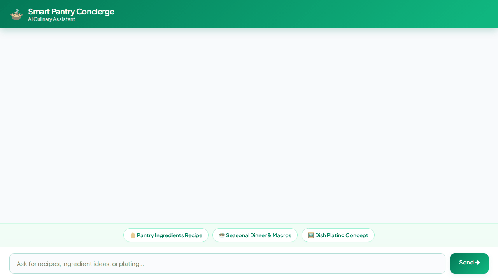

# Smart Pantry Concierge 🍲

> A conversational culinary assistant built on Google Agent Development Kit (ADK) that turns pantry ingredients into tailored recipes, tracks user allergies across sessions, and generates dish plating concepts.



---

## 🌟 Overview & Implemented Capabilities

**Smart Pantry Concierge** helps home cooks discover meals based on ingredients in their pantry, check dietary preferences, locate nearby grocery markets, and visualize dish plating concepts.

### 🛠️ Integrated Google Cloud Services & Tools

The agent code in `app/` implements the following integrations:

- **🧠 Vertex AI Memory Bank Service**: Uses `PreloadMemoryTool` and an `after_agent_callback` (`generate_memories_callback`) to automatically extract, remember, and filter user dietary restrictions, allergies (e.g., gluten, peanut, dairy, lactose, shellfish), and cooking preferences across sessions.
- **🔥 Google Cloud Firestore**: Connects to Firestore to query, search, retrieve detailed instructions for, and insert custom recipe documents (`search_recipes`, `get_recipe_details`, `add_recipe`).
- **🗄️ Google Cloud Storage (GCS)**: Uploads generated dish imagery directly to a public Cloud Storage media bucket (`smart-pantry-concierge-media-94350be9`).
- **🎨 Gemini Image Generation (`gemini-3.1-flash-lite-image`)**: Generates visual food plating concepts and dish photography on demand (`generate_dish_image`).
- **📍 Google Maps APIs**: Integrates Google Maps Geocoding (`geocode_address`) and Places API (New) (`find_nearby_places`) to convert addresses into coordinates and locate nearby supermarkets and food markets.
- **🌐 TheMealDB API**: Queries public culinary databases for external meal ideas, categories, and ingredient lists (`get_public_meal_ideas`).
- **💻 ADK Agent Engine Code Executor**: Runs Python code safely inside an isolated Agent Engine sandbox (`AgentEngineSandboxCodeExecutor`) for complex data processing.
- **🖼️ Agent-Driven A2UI (v0.8 Basic Catalog)**: System prompt and callbacks format model output directly into rich UI cards (Cards, Columns, Rows, Text, Images) displayed natively in the chat interface.

---

## 📁 Repository Structure

```
smart-pantry-concierge/
├── app/                        # Core ADK Agent application
│   ├── agent.py                # Main agent definition, tools, and callbacks
│   ├── a2ui_utils.py           # A2UI response transformer callback
│   └── fast_api_app.py         # FastAPI agent backend entrypoint
├── frontend/                   # Custom chat frontend & proxy
│   ├── main.py                 # FastAPI proxy server talking A2A protocol
│   └── static/index.html       # Branded chat UI with A2UI renderer
├── agents-cli-manifest.yaml    # Deployment & agent configuration metadata
├── pyproject.toml              # Dependencies & project configuration
├── demo.gif                    # Inline recorded demo animation
└── record_demo.js              # Playwright automation script for demo recording
```

---

## 🚀 Setup & Local Execution

### Prerequisites

- **Python 3.10+** and **uv** package manager
- **agents-cli**: Install via `uv tool install google-agents-cli`
- **Google Cloud SDK**: Authenticated via `gcloud auth application-default login`

### Installation

Install dependencies locally using `uv`:

```bash
uv sync
```

### Running Locally

#### 1. Development Playground (ADK Web)

To start the agent playground locally with Vertex AI Memory Bank support:

```bash
uv run adk web . --port 8080 --reload_agents
```

#### 2. Custom Frontend Proxy

To run the custom chat proxy and branded web interface locally:

```bash
cd frontend
pip install -r requirements.txt
export AGENT_ENGINE_RESOURCE_NAME="projects/<PROJECT_NUMBER>/locations/<REGION>/reasoningEngines/<ENGINE_ID>"
export AGENT_DIRECTORY="app"
python main.py
```

---

## ☁️ Deployment

### Deploying the Agent to Agent Platform

Deploy the agent logic to Google Cloud Agent Runtime:

```bash
agents-cli deploy --update-env-vars GOOGLE_MAPS_API_KEY="YOUR_KEY"
```

### Deploying the Web Frontend to Cloud Run

Build and ship the containerized web frontend:

```bash
cd frontend
gcloud run deploy smart-pantry-frontend \
  --source . \
  --region us-east1 \
  --allow-unauthenticated \
  --set-env-vars AGENT_ENGINE_RESOURCE_NAME="projects/<PROJECT_NUMBER>/locations/us-east1/reasoningEngines/<ENGINE_ID>",AGENT_DIRECTORY="app"
```

Grant the Cloud Run service account access to reasoning engines:

```bash
gcloud projects add-iam-policy-binding <PROJECT_ID> \
  --member="serviceAccount:<PROJECT_NUMBER>-compute@developer.gserviceaccount.com" \
  --role="roles/aiplatform.user"
```
